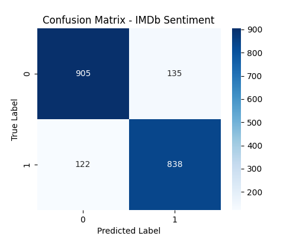
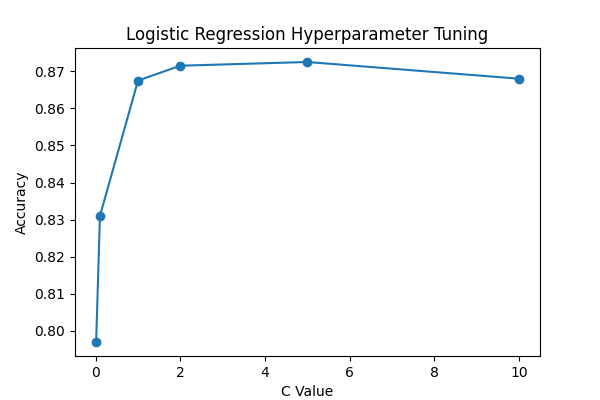
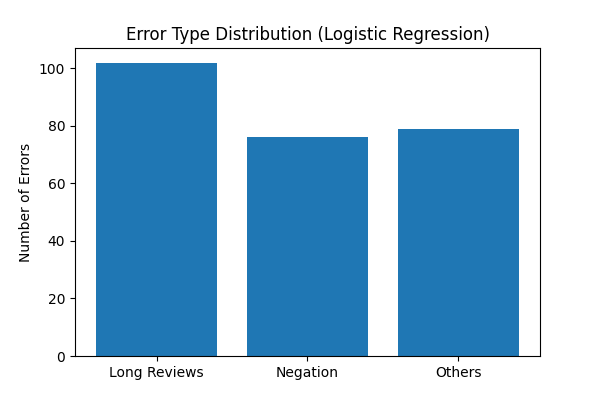

# Sentiment Analysis

## Overview

This project performs binary sentiment classification
on IMDb movie reviews using TF-IDF features and
multiple machine learning models.

The goal is to classify reviews as positive or negative
and compare the performance of different classifiers.
---

## Key Highlights

- Built complete NLP pipeline from raw text to evaluation
- Compared three classical ML models
- Performed hyperparameter tuning
- Conducted error analysis with interpretability

## Dataset

Source:
HuggingFace IMDb Dataset

Training Samples: 10,000

Testing Samples: 2,000

Labels:

- 0 = Negative
- 1 = Positive

---

## Model Pipeline

Text Reviews
→ TF-IDF Vectorization
→ Model Training
→ Evaluation
---

## Feature Engineering

TF-IDF

- max_features=15000
- ngram_range=(1,2)
- stop_words='english'

---

## Models

### Logistic Regression

- solver='liblinear'
- max_iter=2000
- C=2.0

### Linear SVM

- LinearSVC()

### Naive Bayes

- MultinomialNB()


## Results

The following models were evaluated on the sampled
IMDb dataset:

| Model | Accuracy |
|------|---------|
| Logistic Regression | 87.0% |
| Linear SVM | 85.6% |
| Naive Bayes | 83.7% |

### Per-class Performance

We report precision, recall, and F1-score for both classes.

This helps evaluate whether the model is biased toward
positive or negative sentiment.


---

## Experiments

Although all models use the same TF-IDF features,
their performance differs due to their underlying assumptions.

Logistic Regression performs best due to its ability
to learn feature weights effectively.

Linear SVM achieves similar performance, while
Naive Bayes is limited by its independence assumption.


## Visualization

Confusion Matrix



---

## Hyperparameter Tuning

We tuned the regularization parameter C for Logistic Regression.

The results are shown below:



### Observation

- Performance improves when C increases from 0.01 to 2.0
- Best performance is achieved around C = 2.0
- Too large C does not significantly improve results


## Error Analysis

Error analysis is performed on the Logistic Regression model.
We use heuristic rules to categorize common error patterns.
### Error Distribution



### Observations

- Long reviews are the most difficult to classify
- Negation sentences cause significant errors
- Remaining errors come from ambiguous or mixed sentiment text

### Example Misclassified Samples

We inspect some incorrectly predicted samples to better understand model limitations.

- Text: "not bad at all"
  - True: Positive
  - Pred: Negative
  - Reason: Negation handling issue

- Text: "The movie started well but became boring later..."
  - True: Positive
  - Pred: Negative
  - Reason: Mixed sentiment in long text

These examples show that TF-IDF + linear models struggle with
context and compositional meaning.


## Future Improvements

- Explore advanced feature engineering (e.g., n-grams tuning, TF-IDF variants)
- Implement deep learning models (LSTM, BERT)
- Conduct error analysis on misclassified samples
- Compare traditional ML methods with transformer-based models
---

## Project Structure

```text
sentiment_analysis/
│
├── main.py
├── README.md
├── results/
│   └── confusion_matrix.png
└── requirements.txt
```

## Tech Stack

- Python
- Scikit-learn
- Pandas
- Matplotlib
- Seaborn

## How to Run

Install dependencies:

```bash
pip install -r requirements.txt
```

Run the project:

```bash
python main.py
```


## Conclusion

This project demonstrates a complete NLP pipeline
for sentiment classification using traditional machine learning methods.

Among all tested models, Logistic Regression achieved the best performance,
showing strong effectiveness on TF-IDF-based text features.

The results also highlight the trade-offs between different classifiers:
simplicity (Naive Bayes), robustness (SVM), and overall performance (LogReg).